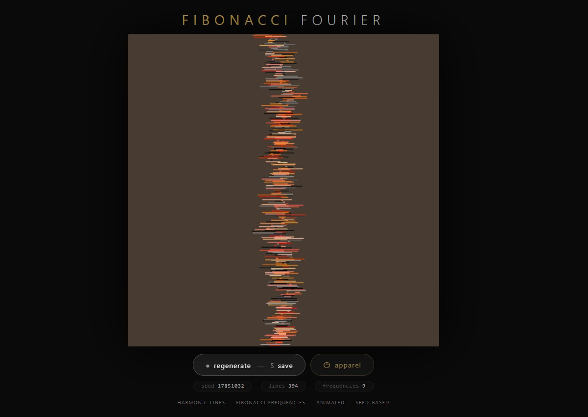
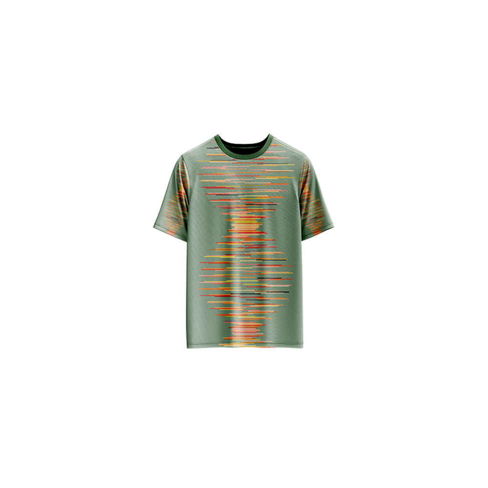

# Fibonacci Fourier — Generative Art

[](https://reyrove.github.io/Fibonacci-Fourier-Generative-Art)
[](https://opensource.org/licenses/MIT)

> **Generative harmonic art with Fibonacci frequencies.** Each refresh creates a unique animated composition of vertical lines that pulse and wave with harmonious colors, driven by the mathematical beauty of the Fibonacci sequence and Fourier synthesis.

## 🎨 Live Demo

<div align="center">
  <a href="https://reyrove.github.io/Fibonacci-Fourier-Generative-Art" target="_blank">
    
  </a>
  <br><br>
  <a href="https://reyrove.github.io/Fibonacci-Fourier-Generative-Art" target="_blank">
    
  </a>
  <br>
  <em>Click the image or button to experience the generative art</em>
</div>

## 👕 Apparel Preview

<div align="center">
  
  <br>
  <em>Fibonacci Fourier artwork printed on a T-shirt</em>
</div>

## ✨ Features

- **Harmonic Waves** — Vertical lines that pulse and wave with sine functions
- **Fibonacci Frequencies** — Frequencies drawn from the Fibonacci sequence
- **Animated Motion** — Continuous, flowing animation
- **Rich Color Palettes** — Harmonious HSL colors with random base hues
- **Dark Backgrounds** — 150+ rich, dark color options
- **Dynamic Line Widths** — Each line has a unique, evolving width
- **Seed-Based** — Every composition is unique and reproducible via its seed
- **Save & Share** — Download as PNG with seed in filename
- **Apparel Mode** — Preview artwork on a T-shirt mockup
- **Responsive** — Works on desktop, tablet, and mobile
- **Pure JavaScript** — No external dependencies
- **Keyboard Shortcuts**:
  - `R` — Regenerate
  - `S` — Save image
  - `T` — Toggle apparel view

## 🎨 Artwork Details

| Parameter | Range | Description |
|-----------|-------|-------------|
| **Lines** | 50–400 | Number of vertical lines |
| **Sine Functions** | 1–25 | Number of superimposed waves |
| **Frequencies** | Fibonacci | From the Fibonacci sequence |
| **Background Colors** | 150+ | Rich dark colors |
| **Color Harmony** | HSL | Analogous color schemes |

## 🔢 The Mathematics

### Fibonacci Sequence
The artwork uses frequencies from the Fibonacci sequence:
```
0, 1, 1, 2, 3, 5, 8, 13, 21, 34, 55, 89, 144, 233, 377, 610, 987, 1597, 2584, 4181, 6765
```

### Fourier Synthesis
Each line's position is determined by the sum of multiple sine waves (Fourier synthesis), creating complex, harmonic wave patterns.

### Color Harmony
Colors are generated using HSL (Hue, Saturation, Lightness) with analogous harmonies, ensuring visually pleasing color combinations.

## 🚀 Quick Start

### Local Development

```bash
# Clone the repository
git clone https://github.com/reyrove/Fibonacci-Fourier-Generative-Art.git

# Navigate to the directory
cd Fibonacci-Fourier-Generative-Art

# Open in browser
open index.html
# or use a live server
```

### Deploy to GitHub Pages

1. Push to GitHub
2. Go to Settings → Pages
3. Select branch `main` and root folder
4. Your site will be live at `https://reyrove.github.io/Fibonacci-Fourier-Generative-Art`

## 🧠 How It Works

The artwork is generated using a deterministic random number generator, seeded by timestamp + random noise. Every refresh:

1. **Setup**:
   - Random dark background from 150+ colors
   - 50-400 vertical lines
   - 1-25 sine functions with Fibonacci frequencies
   - Random base hue for color harmony

2. **Animation**:
   - Each line's vertical position is a sum of sine waves
   - Time variable creates continuous motion
   - Colors shift subtly through harmonious changes

3. **Rendering**:
   - Lines drawn vertically with varying widths
   - Each line has a unique color from the harmony
   - Smooth, flowing wave patterns

## 📁 File Structure

```
Fibonacci-Fourier-Generative-Art/
├── index.html              # Main application (all-in-one)
├── Fibonacci-Fourier.jpg   # T-shirt mockup image
├── fav.svg                 # Favicon
├── demo-screenshot.jpg     # Website demo screenshot
├── README.md               # This file
└── LICENSE                 # MIT License
```

## 🛠️ Tech Stack

- **Pure Vanilla HTML/CSS/JS** — No dependencies
- **Canvas API** — 2D rendering
- **HSL Color Model** — Color generation
- **CSS Flexbox/Grid** — Responsive layout
- **GitHub Pages** — Hosting

## 🎯 Interactive Controls

| Action | Keyboard | Button |
|--------|----------|--------|
| Regenerate | `R` | Click "regenerate" |
| Save Image | `S` | Click "regenerate" |
| Toggle Apparel | `T` | Click "apparel" |

## 🎨 The Creative Process

### Fourier Synthesis
The vertical position of each line is determined by:
```
position = sum(sin(frequency * x + time))
```
This creates complex, wave-like patterns reminiscent of Fourier analysis.

### Fibonacci Frequencies
Using Fibonacci numbers as frequencies creates natural, harmonious wave patterns that resonate with the mathematical beauty found in nature.

### Color Harmony
Colors are generated using analogous harmonies in HSL space, where each line's color shifts slightly in hue, saturation, and lightness, creating a cohesive, beautiful palette.

### Dynamic Width
Each line's width evolves over time, adding another layer of organic, living quality to the artwork.

## 📱 Responsive Design

The application automatically adapts to:
- Desktop screens
- Tablets
- Mobile phones
- Landscape orientation
- Various aspect ratios

## 🤝 Contributing

Contributions are welcome! Feel free to:
- Fork the repository
- Create a feature branch
- Submit a pull request

### Ideas for Contributions:
- New wave functions
- Additional color palettes
- Interactive controls
- Performance optimizations

## 📄 License

MIT License — see [LICENSE](LICENSE) file for details.

## 🙏 Acknowledgments

- Inspired by Fourier analysis and the Fibonacci sequence
- Pure JavaScript implementation
- Special thanks to the creative coding community

---

**Built with ❤️ and mathematical harmony**